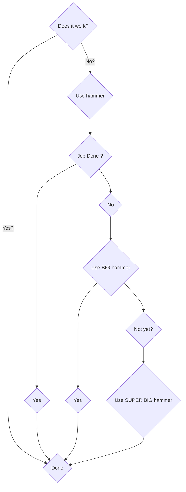

#### CV




```
flowchart TD;
  start{Does it work?} -- Yes? --> jobDone{Done};
  start{Does it work?} -- No? --> use_hammer_1{Use hammer};
  use_hammer_1{Use hammer} --> job_done_1{Job Done ?} 
  job_done_1{Job Done ?} --> yes_1{Yes};
  job_done_1{Job Done ?} --> no_2{No};
  no_2{No} --> use_hammer_2{Use BIG hammer};
  use_hammer_2{Use BIG hammer} --> yes_2{Yes?};
  use_hammer_2{Use BIG hammer} --> no_3{Not yet?};
  no_3{Not yet?} --> use_hammer_3{Use SUPER BIG hammer};
  yes_1{Yes} --> jobDone{Done};
  yes_2{Yes} --> jobDone{Done};
  use_hammer_3{Use SUPER BIG hammer} --> jobDone{Done};
```
