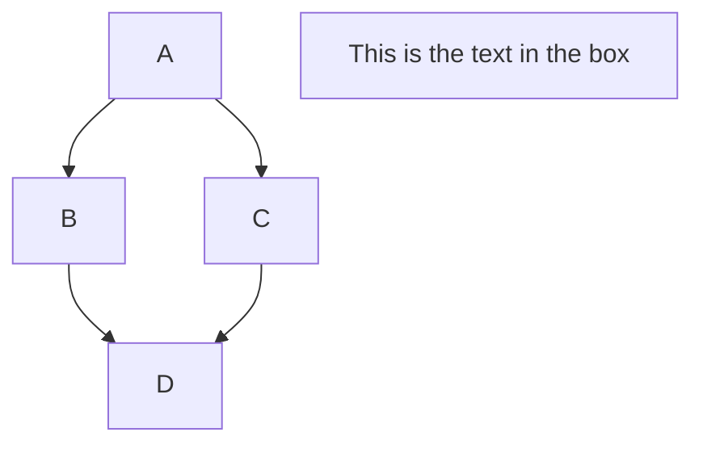

#### CV

```mermaid
  graph TD;
      A-->B;
      A-->C;
      B-->D;
      C-->D;
      id1[This is the text in the box];
```

```mermaid
flowchart TD;
  A-->B;
  A-->C;
  B-->D;
  C-->D;
  id1[This is the text in the box];
```

```mermaid
  flowchart TD;
    A-->B;
    A-->C;
    B-->D;
    C-->D;
    id1[This is the text in the box];
```

