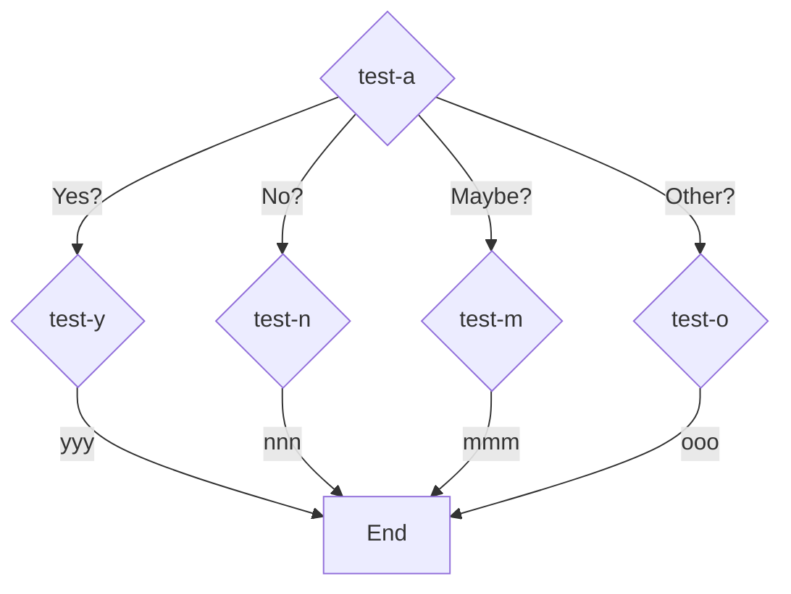

#### CV

```mermaid
flowchart TD;
  A{test-a} -- Yes? --> Y{test-y};
  A{test-a} -- No? --> N{test-n};
  A{test-a} -- Maybe? --> M{test-m};
  A{test-a} -- Other? --> O{test-o};
  Y -- yyy --> End;
  N -- nnn --> End;
  M -- mmm --> End;
  O -- ooo --> End;
```
